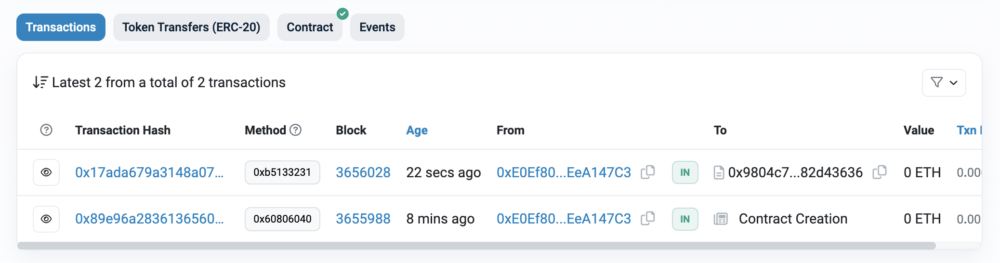

# Upgraeable contracts
* It's using `@openzeppelin/contracts-upgradeable`.
* Check `deployERC20.ts` and `upgradeERC20.ts`. The first one is for deploying and the next one is for upgrading for ERC20 contract. (i.e.: `npx hardhat run --network sepolia scripts/deployERC20.ts`)
* Using Transparent pattern for upgrade.


# Deployment Testnet
* Before deploy to the Sepolia, creat `.infura` and `.secret`.
* `.infura` is your infura project id to interact Sepolia. DO NOT commit this file.
* `.secret` is your metamask wallet secret. DO NOT commit this file. It's your wallet secret.
* Check `hardhat.config.ts` for deploying to Sepolia.

# How to test after deployment
* Open a JS console by running `npx hardhat console --network sepolia`
* In the console, `let myContract = await (await ethers.getContractFactory(CONTRACT_NAME)).attach(PROXY_CONTRACT_ADDRESS);`
* Then execute functions to test (ex: `getVal1()`)
* After upgrade, execute new functions from V2 contract.
* When you upgrade your contract, you can see that the contract has been upgraded via Etherscan. Check "Transactions" and "Events".


# Sample Hardhat Project

This project demonstrates a basic Hardhat use case. It comes with a sample contract, a test for that contract, and a script that deploys that contract.

Try running some of the following tasks:

```shell
npx hardhat help
npx hardhat test
REPORT_GAS=true npx hardhat test
npx hardhat node
npx hardhat run scripts/deploy.ts
```
